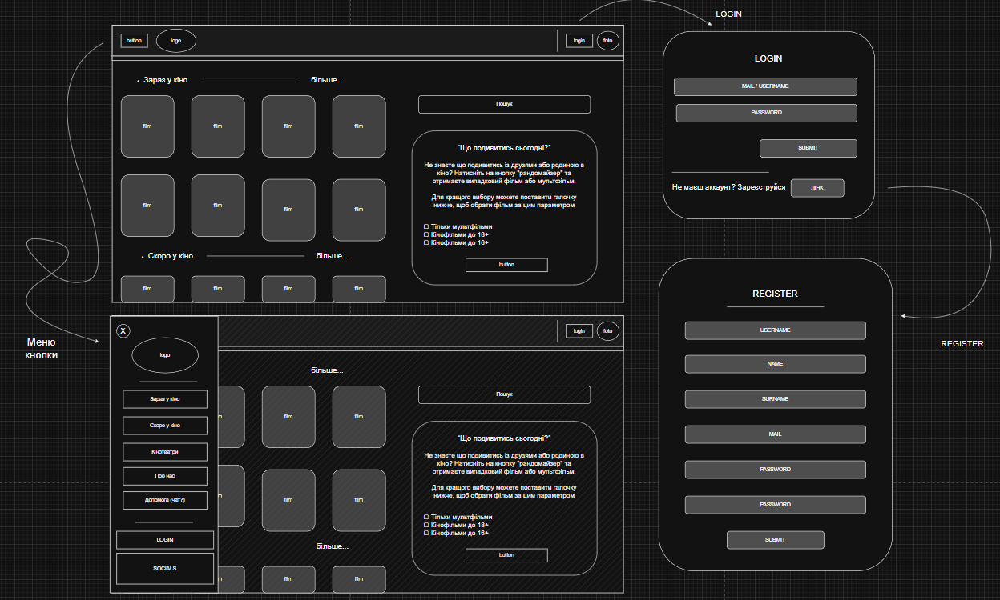
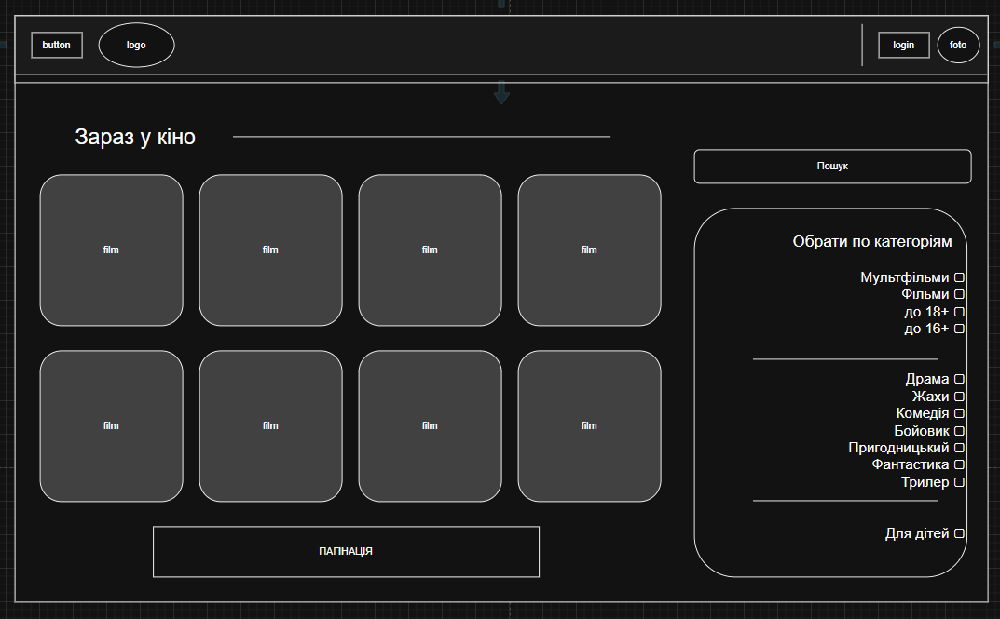
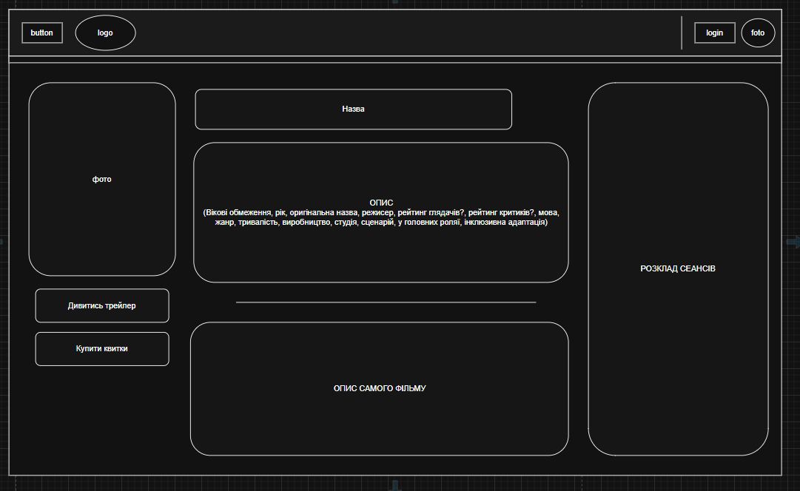
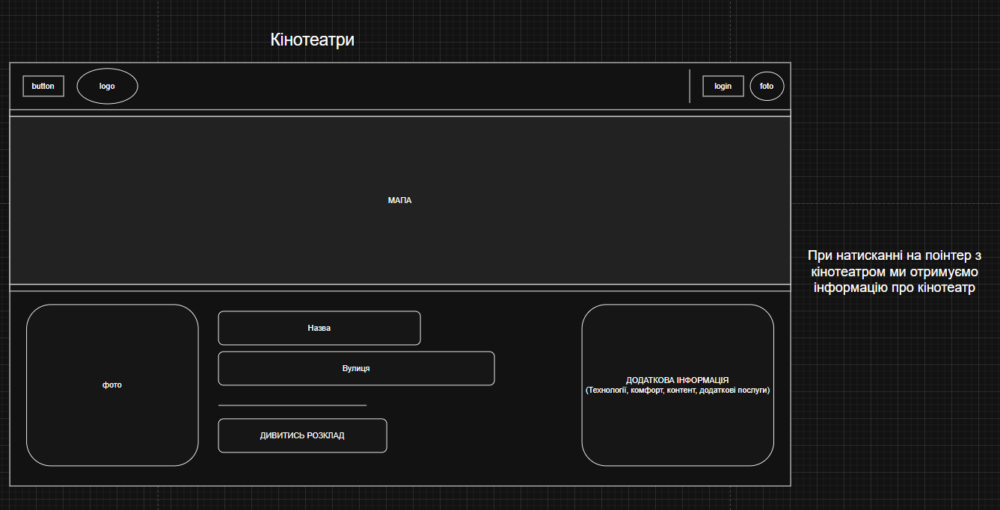
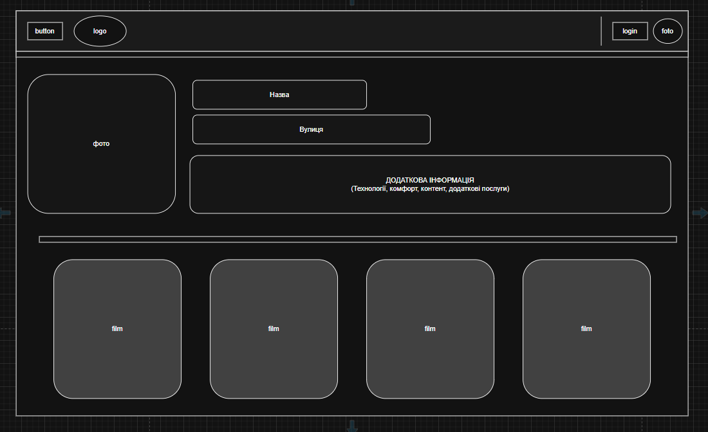
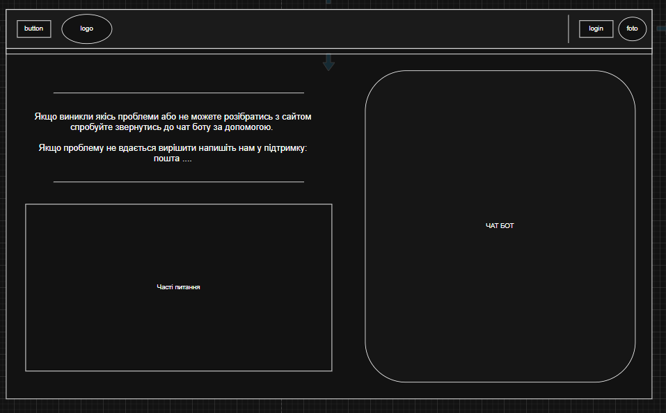
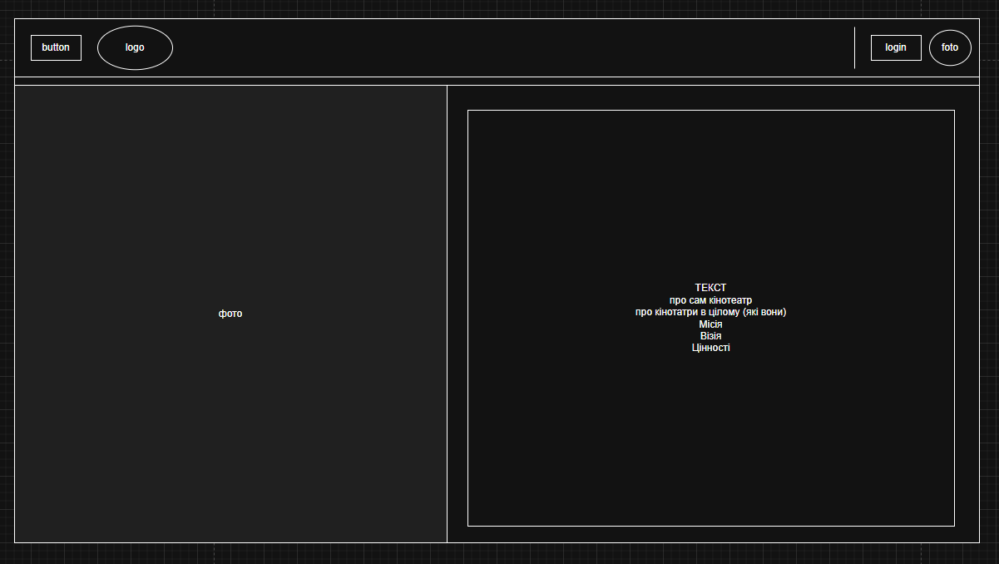

# Project theme: Cinema

> Members: [DarkHeavenAngel](https://github.com/DarkHeavenAngel), [plusikkk](https://github.com/plusikkk), [nikashevhenko](https://github.com/nikashevchenko)

## Idea:
  Our main project idea is to create a website for a cinema with interactive features to make choosing a film even more fun. Our goal is to combine the convenience of obtaining information about movies with interactivity to turn a simple film search into a small     entertainment experience and increase visitor interest.

## Features:

### 1. Home Page
The main page serves as a central hub, displaying a list of films currently in theaters.  
**Key elements:**
- **Navigation Bar:** Includes the project Logo, links for User Authentication (Sign Up / Log In), and a prominent Randomizer button.  
- **Current Premieres:** Banners or a list showcasing the latest and hottest releases.

---

### 2. Film Catalog
A comprehensive list of all movies currently running and those scheduled for release soon.  
Each movie card includes:
- Poster  
- Title, Genre, Age Restriction, Rating (IMDb/Rotten Tomatoes)  
- Short Description  
- "Details" Button to navigate to the individual film page.

---

### 3. Search, Filters, and Sorting
Users can efficiently find their next movie using detailed search and filtering options:
- **Search:** by Title, Genre, Actor, or Director  
- **Filtering:**
  - Genre (Comedy, Thriller, Sci-Fi, etc.)
  - Release Date (New releases)
  - Rating (User/Critic scores)
  - Age Category (PG-13, R)

---

### 4. Individual Movie Page
A dedicated page providing all necessary information for the user to make an informed choice:
- Poster and embedded Trailer  
- Full plot Synopsis, Cast and Director list, Genre, Running Time, and Age Restriction  
- Ratings (public and critic scores)  
- Showtime Schedule — interactive and clear  
- “Select Session and Seat” button

---

### 5. Seating Selection and Ticket Purchase
After selecting a specific showtime, the user is redirected to a smooth purchase flow:
- Interactive Seating Map (cinema hall layout)  
- Seat Status Indicators (Available, Booked, VIP)  
- Checkout flow: select seats → "Buy Ticket" → order creation and confirmation

---

### 6. The "Randomizer" Feature
A fun solution for indecisive users:
- **Random Selection:** picks a random currently-running movie  
- **Filtered Randomizer:** apply filters (e.g. “Only Comedies”, “Rating 7+”) before generating

---

### 7. User Account & Authentication
A personalized experience for each user:
- Registration / Log In  
- **User Profile:** personal data (name, email, password) and order history of purchased tickets

---

### 8. About Us and Location Page
Information about the cinema network:
- Contact information (address, email, phone)  
- Interactive map (Google Maps API)  
- Details about cinema halls and schedules

---

### 9. Admin Panel
A backend interface for administrative control:
- Add / Edit / Delete films and schedules  
- Manage users and ticket orders

## Possible visualization:
>One of the possible options for the website design. Some of the features shown in the screenshots are only ideas and may not be implemented, so we are not responsible for any expectations associated with them.
1. Main page + registration + login

 
 
2. Page with screened movies (the same for movies that will be available soon)  

 
 
3. Page with full information about movies

 
 
4. Page with a map and cinemas info

 
 
5. Page with full information about cinemas

 
 
6. Page with help information

 
 
7. Page with information about us

 
 

